The listings import `@preview/keisen:0.1.0`, which is how they will read once the package is released.
There is no release yet, so a reader trying them today imports `lib.typ` from a clone instead.

Every table on this page is rendered from a file in the repository's `tests/visual/` directory, and each image is that file's own output, regenerated by `tools/render-docs-assets.sh`.
The listings are the test sources, quoted; `tools/check.sh` compiles those tests on every run, so the code shown here is code that compiles, though nothing yet compares a listing to its file automatically.

## A formatted table

The smallest thing worth calling a display table: a title, labelled columns, formatted numbers, and a source note.

```typst
#import "@preview/keisen:0.1.0": *

#display-table(
  (
    model: ("Audi A4", "BMW 320i", "Volkswagen Golf"),
    consumption: (7.25, 8.5, 6.125),
    year: (2019, 2021, 2020),
  ),
  table-header(
    title: [Fuel consumption],
    subtitle: [Litres per 100 kilometres],
  ),
  columns-label(model: [Model], consumption: [Consumption], year: [Year]),
  format-number("consumption", decimals: 2),
  format-integer("year", grouping: none),
  table-source-note([Source: manufacturer figures.]),
)
```

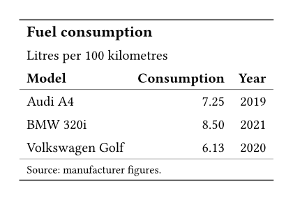

Numeric columns align themselves against the end edge and the others against the start edge, so nothing needed saying about alignment.
`6.125` rounds to `6.13`: the default is half-up, computed in decimal arithmetic rather than in floats.

## Groups and summaries

A stub turns a column into row names, and a second column into groups.
Summaries close each group and then the body.

```typst
#display-table(
  (
    product: ("Bolt", "Nut", "Beam", "Plate"),
    region: ("North", "North", "South", "South"),
    units: (1250, 860, 430, 2100),
    revenue: (18750.5, 12900.25, 21500, 31500.75),
  ),
  table-header(title: [Regional sales], subtitle: [Financial year 2025 to 2026]),
  table-stub(rowname: "product", group: "region", label: [Product]),
  columns-label(units: [Units], revenue: [Revenue]),
  table-spanner([Performance], ("units", "revenue")),
  format-integer("units"),
  format-number("revenue", decimals: 2),
  summary-rows(functions: (Subtotal: aggregate-sum), columns: ("units", "revenue")),
  grand-summary-rows(functions: (Total: aggregate-sum), columns: ("units", "revenue")),
  table-source-note([Source: internal ledger.]),
  table-options(row-striping: true),
)
```

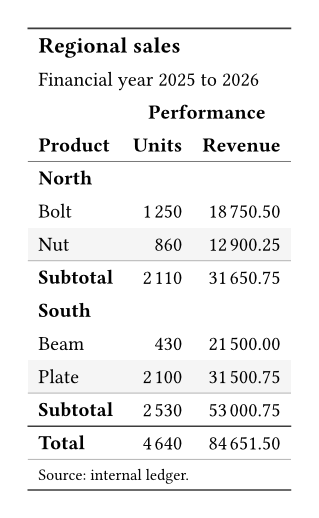

Striping counts body rows alone, so a group label never takes a stripe or shifts the phase.
`aggregate-sum` stays in decimal arithmetic, so the totals are exact rather than nearly right.

### Picking a summary out

A subtotal is addressed like any other cell, through `cells-summary` and `cells-grand-summary`.

```typst
  summary-rows(functions: (Subtotal: aggregate-sum), columns: ("units", "revenue")),
  grand-summary-rows(functions: (Total: aggregate-sum), columns: ("units", "revenue")),
  table-style(style(fill: luma(235)), locations: cells-summary()),
  table-style(
    style(text: (fill: rgb("#08519c"))),
    locations: cells-grand-summary(columns: "revenue"),
  ),
  table-footnote(
    [Subtotals exclude intra-group sales.],
    locations: cells-summary(groups: "North", columns: none),
  ),
  table-footnote([Audited.], locations: cells-grand-summary(columns: "revenue")),
```

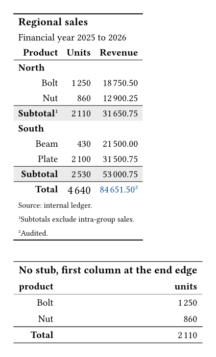

`cells-summary()` with no arguments takes the whole row, its label cell included.
`columns: none` is that label cell alone, which is how the note lands on the row once instead of on each of its cells.
A summary row answers to its label as readily as to its position, so `rows: "Subtotal"` says what `rows: 0` says.

## One column from several

An estimate beside its error, and an interval from its bounds, each read as one column because that is how a reader reads them.

```typst
  format-number("estimate", decimals: 2),
  format-number("error", decimals: 3),
  columns-combine(
    "effect",
    ("estimate", "error"),
    (value, margin) => [#value #h(0.2em) (#margin)],
    label: [Effect (SE)],
  ),
  columns-combine("interval", ("lower", "upper"), (low, high) => [#low #sym.dash.en #high], label: [95% CI]),
```

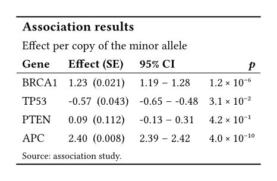

The estimate keeps two decimals and the error three, because the pattern receives the formatted content of its sources rather than their raw values.
That is why `combine` sits after `format` in the pipeline, and it is also the price: a combined column carries content, so it is opaque afterwards, aligned to the start and outside any summary.

## Money, magnitudes, and sizes

Each of these fills a slot the alignment stage reserves, so the columns line up on what matters: prices under their symbols, exponents under their multiplication signs, units under units.

```typst
  format-currency("price", currency: "EUR"),
  format-scientific("charge", decimals: 2),
  format-bytes("firmware"),
```


The second table is the same figures said differently: `position: end` for the currencies written that way, `exponent: "e"` for output rather than typesetting, and `base: 1000` for the people who sell disks.
A yen figure carries no decimals, because the currency has no minor unit and two places would invent a precision it does not circulate in.

### Dates and markup

Neither produces alignment slots: a date has no separator to line up on, and a cell of markup is whatever it evaluates to, so both follow the column alignment like any other text.

```typst
  format-date("published", pattern: "[day] [month repr:long] [year]"),
  format-markup("summary"),
```

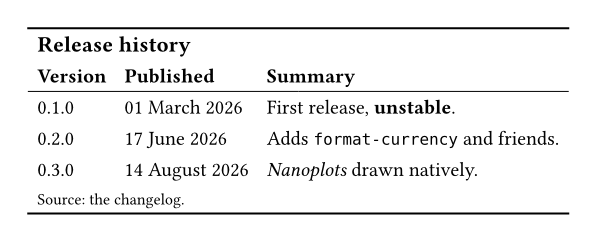

The three dates were written three different ways in the data: an ISO date, an ISO timestamp, and a `datetime` the document built.
The summaries are Typst markup carried as text, which is what a generator emits when a cell has emphasis it cannot express as content.

## Styling by what the data says

A cell is highlighted because of its value, not its position.
This is the thing show rules cannot do: they select by element type in document order and never see the row behind a cell.

```typst
#display-table(
  (
    product: ("Bolt", "Nut", "Beam", "Plate"),
    region: ("North", "North", "South", "South"),
    units: (1250, 860, 430, 2100),
    margin: (0.182, 0.031, 0.094, none),
  ),
  table-header(title: [Regional sales], subtitle: [Financial year 2025 to 2026]),
  table-stub(rowname: "product", group: "region", label: [Product]),
  columns-label(units: [Units], margin: [Margin]),
  table-spanner([Performance], ("units", "margin")),
  format-integer("units"),
  format-percent("margin", decimals: 1),
  substitute-missing("margin", replacement: [--]),
  data-colour(("#f7fbff", "#08519c"), columns: "units"),
  table-style(
    style(text: (fill: rgb("#b2182b"), weight: "bold")),
    locations: cells-body(
      columns: "margin",
      rows: row => row.margin != none and row.margin < 0.05,
    ),
  ),
  table-footnote([Excludes intra-group sales.], locations: cells-column-labels(columns: "units")),
  table-footnote([Margin was not reported.], locations: cells-body(columns: "margin", rows: 3)),
  table-source-note([Source: internal ledger.]),
)
```

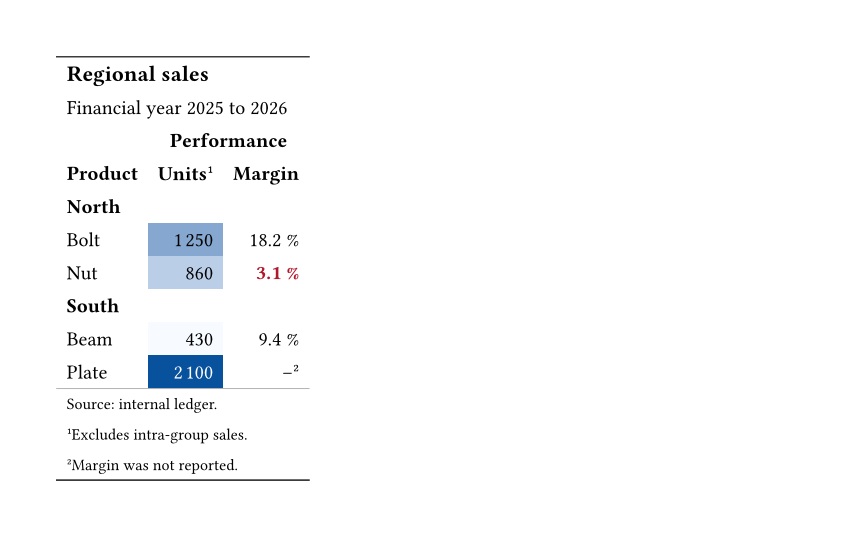

Three things happened without being asked for.
The dark blue fills carry white text, chosen per cell from the background's relative luminance.
The missing margin was replaced before it reached the formatter, which would otherwise have refused it.
The marks are numbered in the order a reader meets them, so the column label takes 1 and the body cell takes 2, whichever order they were written in.

## A table that breaks across pages

```typst
#display-table(
  readings,
  table-header(title: [Station readings]),
  table-stub(rowname: "station", group: "region", label: [Station]),
  columns-label(temperature: [Temperature], humidity: [Humidity]),
  columns-width(("station": 3.2cm)),
  format-number("temperature", decimals: 2),
  format-integer("humidity"),
  summary-rows(functions: (Mean: aggregate-mean), format: format-number(auto, decimals: 2)),
  table-source-note([Source: station log.]),
)
```

::: {layout-ncol=2}
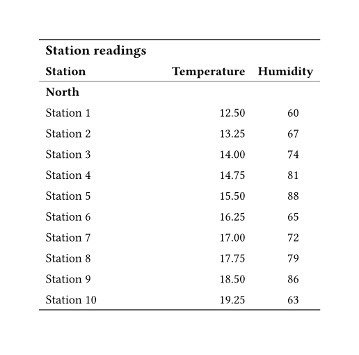

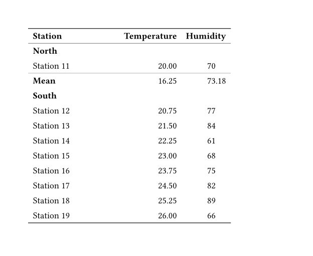
:::

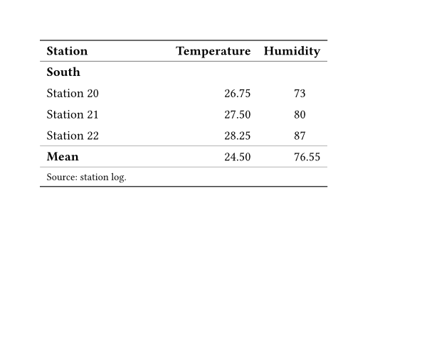

The second page is the point.
Row groups are rendered as native level-3 subheaders, so a group carrying on past a page break reprints its own label under the repeated column labels, and the next group retires it automatically.

## Nanoplots

In-cell plots are drawn by whichever renderer is passed, and the domain is shared down the column so the cells can be compared.

```typst
#import "@preview/keisen:0.1.0": *

#let trends = (
  (1.0, 1.2, 1.1, 1.4, 1.8, 2.1),
  (2.0, 1.8, 1.6, 1.5, 1.2, 0.9),
  (1.5, 1.5, 1.6, 1.5, 1.7, 1.6),
)

#display-table(
  (asset: ("Equities", "Bonds", "Cash"), trend: trends, volume: trends, weight: (0.62, 0.31, 0.07)),
  table-header(title: [Portfolio], subtitle: [Twelve-month trends]),
  table-stub(rowname: "asset", label: [Asset]),
  columns-label(trend: [Trend], volume: [Volume], weight: [Weight]),
  format-nanoplot("trend", plot: nanoplot-line, width: 6em, height: 1em, baseline: 25%),
  format-nanoplot("volume", plot: nanoplot-bar, width: 6em, height: 1em, baseline: 25%),
  format-percent("weight", decimals: 1),
  table-source-note([Source: portfolio ledger.]),
)
```

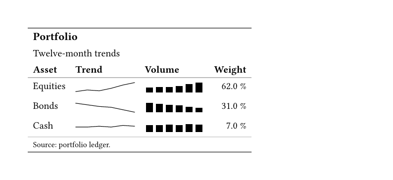

Cash reads as flat because all three rows share one scale, taken from the column itself rather than passed in.
Scaled per cell, its small wobble would draw exactly like the others' real movement, which is how a nanoplot lies.

The renderers are drawn with native Typst primitives and come out of the package like everything else, so nothing else is fetched to draw them.
Because every coordinate is a fraction of the box, an `em` size needs no absolute resolution and no minimum canvas, which is what lets a nanoplot be the size a nanoplot is meant to be.

```typst
Revenue rose through the year #nanoplot-line(series, width: 4em), reading
#nanoplot-points(series, width: 4em) by quarter and
#nanoplot-bar(series, width: 4em) by volume, all at #raw("0.8em").
```

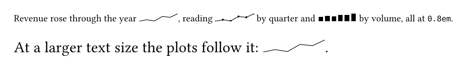

The second line is the point: the plots carry no size of their own, so `set text(size: ..)` moves them with everything else.

`format-nanoplot` takes any `(numbers, domain: none, width: .., height: ..) => content`, so a renderer written in the document works exactly as well as the three that ship.

## Right to left

Nothing in the table is written for one direction.
Cells align to `start` and `end` rather than to a side, so a table under `#set text(dir: rtl)` mirrors with the text.

```typst
#set text(dir: rtl)
```


The columns run the other way and the stub sits last, because Typst lays a table out along the writing direction.
Inferred alignment follows: text goes to the start of its cell and numbers to the end, whichever side those are on.

A number is the exception, and deliberately so.
Its digits, separator and any exponent are pinned left to right, since a number reads the same way in every script.
