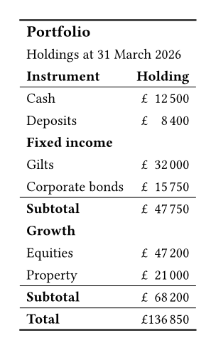

Not every table arrives with a column saying which rows belong together.
`table-row-group` declares a block from the document instead, taking a label and the ordinary row selector: an index, an array of indices, or a predicate.

```typst
#import "@preview/keisen:0.1.0": *

#display-table(
  (
    instrument: ("Cash", "Deposits", "Gilts", "Corporate bonds", "Equities", "Property"),
    holding: (12500, 8400, 32000, 15750, 47200, 21000),
  ),
  table-header(title: [Portfolio], subtitle: [Holdings at 31 March 2026]),
  table-stub(rowname: "instrument", label: [Instrument]),
  columns-label(holding: [Holding]),
  table-row-group([Fixed income], (2, 3)),
  table-row-group([Growth], row => row.instrument in ("Equities", "Property")),
  format-currency("holding", currency: "GBP", decimals: 0),
  summary-rows(functions: (Subtotal: aggregate-sum), columns: ("holding",)),
  grand-summary-rows(functions: (Total: aggregate-sum), columns: ("holding",)),
  theme: theme-booktabs(),
)
```



The two rows no group claims lead the body as a nameless block, exactly as an ungrouped table does, so a group need not cover the data.
Both spellings of the selector appear above: `(2, 3)` names the rows, and the predicate reads them.

Once the groups exist, `summary-rows` closes each one as it would for [groups that came from a column](total-by-group.qmd).

Groups come from the data or from the document, never from both.
Passing `table-stub(group: ..)` alongside `table-row-group` is an error rather than a precedence rule nobody wrote down.
Where two declared groups overlap, the later one wins, and a group left with none of its own rows is dropped rather than printed as a label over nothing.
