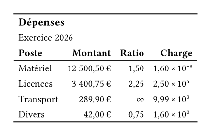

A French table writes a comma where an English one writes a point.
That convention belongs to the document, not to each directive, so it is set once on the theme: every numeric column reads `number-group-separator` and `number-decimal-separator`, whichever formatter it goes through.

```typst
#import "@preview/keisen:0.1.0": *

#display-table(
  (
    poste: ("Matériel", "Licences", "Transport", "Divers"),
    montant: (12500.5, 3400.75, 289.9, 42.0),
    ratio: (1.5, 2.25, float.inf, 0.75),
    charge: (0.0000000016, 250000, 9990, 1.6),
  ),
  table-header(title: [Dépenses], subtitle: [Exercice 2026]),
  table-stub(rowname: "poste", label: [Poste]),
  columns-label(montant: [Montant], ratio: [Ratio], charge: [Charge]),
  format-currency("montant", currency: "EUR", position: end),
  format-number("ratio", decimals: 2, infinity: [∞]),
  format-scientific("charge", decimals: 2),
  table-options(
    number-group-separator: sym.space.nobreak,
    number-decimal-separator: ",",
  ),
  theme: theme-booktabs(),
)
```



The comma appears in the price, the ratio and the mantissa, because all three formatters left their separators at `auto` and `auto` means the theme's.
An argument written on a directive still wins, so one column can depart from the convention without disturbing the rest.

The infinity is the other thing to look at.
Only finite numbers are formatted, so an unbounded value is an error unless `infinity:` says what to write for one.
What it writes is opaque content, which is why it sits in the column without disturbing the decimal alignment of the numbers above it, and why a column holding one cannot be summarised.
